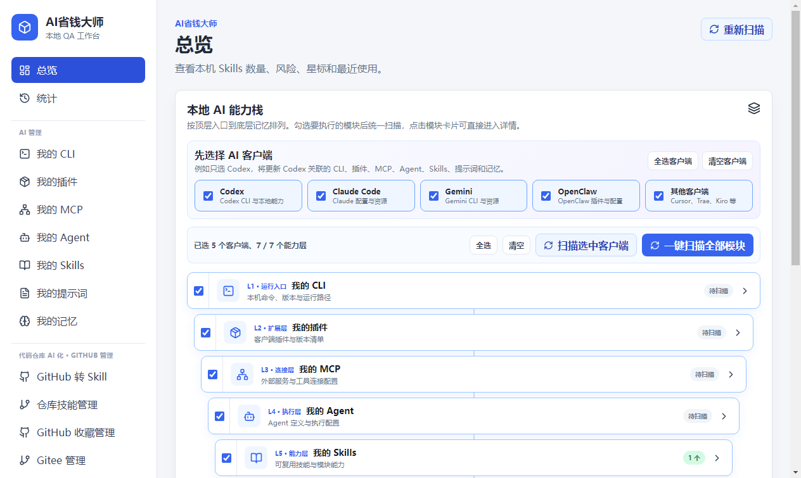
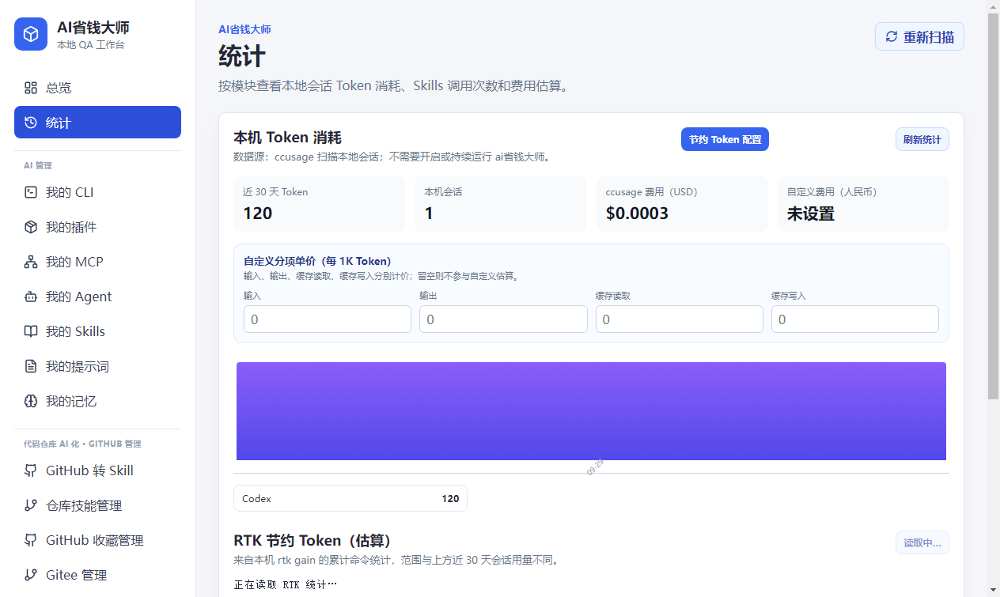

# AI省钱大师

本地 AI 工具、Skills 与 Token 成本管理器。集中管理 AI 开发资产，查看本机 Codex 会话消耗，并通过提示词、可复用 Skills 和 RTK 减少重复工作。

适合同时使用多个 AI 开发工具、积累了许多 Skills 和提示词，希望整理本地资产、了解 Token 消耗并减少重复输入的用户。基于 Electron、React 和 TypeScript，桌面版直接安装使用，无需先安装 Node.js。

当前版本：**0.1.2，公开预览版**。费用统计目前读取本机 **Codex** 会话；其他客户端的资产发现不代表已经接入它们的消费统计。省钱效果取决于任务、模型和使用方式，不承诺固定比例。

## 阅读导航

- [下载安装](#下载安装)
- [五分钟上手](#五分钟上手)
- [功能入口一览](#功能入口一览)
- [模块与 Skills 管理](#模块与-skills-管理)
- [提示词优化与恢复](#提示词优化与恢复)
- [Token 与费用统计](#token-与费用统计)
- [RTK 安装与使用](#rtk-安装与使用)
- [GitHub、Gitee 与社区市场](#githubgitee-与社区市场)
- [其他 AI 资产与场景复用](#其他-ai-资产与场景复用)
- [本地数据与联网范围](#本地数据与联网范围)
- [常见问题](#常见问题)
- [本地开发与构建](#本地开发与构建)
- [独立 CLI](#独立-cli)
- [验证范围与反馈](#验证范围与反馈)

## 名词说明

| 名词 | 在本项目中的含义 |
| --- | --- |
| 模块 | 一个被纳入管理的目录或导入来源，可带名称、标签和启用状态 |
| Skill | 以 `SKILL.md` 为入口的技能目录，可以包含脚本、模板和参考资料 |
| CLI | 在终端运行的命令行工具，例如 Codex、Claude Code；本项目也提供自己的 CLI |
| MCP | AI 客户端连接外部工具或数据源的协议；这里主要发现和查看本地 MCP 配置 |
| Agent | 本地 AI 客户端中的代理定义或配置文件 |
| Token | 模型处理文本的计量单位，与字符数不完全相同 |
| RTK | 用于压缩常见命令输出的工具；安装、客户端集成和实际产生收益是不同状态 |

## 下载安装

打开 [Releases 下载页](https://github.com/yinyin2568/ai-money-master/releases)，选择与你的系统和架构匹配的安装包。**只有下载页实际列出的附件才是已上传产物；没有对应附件时，请使用源码构建。**

| 平台 | 文件 | 状态 |
| --- | --- | --- |
| Windows x64 | `ai-money-master-<版本>-win-x64.exe` | 已生成并完成下述 Windows 验证；下载以 Release 附件为准 |
| macOS Apple Silicon / Intel | `.dmg` / `.zip` | 提供构建工作流；以 Release 的附件和验证说明为准 |
| Linux | — | 暂未提供桌面安装包 |

### Windows 安装与更新

1. 下载 `.exe` 安装包和同一版本的 `SHA256SUMS.txt`。
2. 在下载目录运行下面的 PowerShell 命令，将结果与校验文件中的同名条目比较。
3. 双击安装包，按向导选择安装目录，完成后打开“AI省钱大师”。
4. 更新时先退出应用，再运行新版安装包；重要配置可先备份应用数据目录。

```powershell
Get-FileHash -Algorithm SHA256 .\ai-money-master-0.1.2-win-x64.exe
```

Windows 安装程序支持选择安装目录。当前安装包未配置代码签名；系统可能提示未知发布者，请核对下载来源和 SHA-256 校验值。更新与卸载不会主动删除应用自己的数据目录。安装路径与数据路径相互独立；修改安装路径不会搬迁 Skills 或账号配置。

### 运行依赖

| 使用方式 | 需要另外准备什么 |
| --- | --- |
| 桌面版的本地管理、提示词和 Token 统计 | 无需另装 Node.js；统计需要本机已有 Codex 会话日志 |
| Git 仓库导入、更新 | Git，且应用进程能够找到 `git` 命令 |
| NPX 模块导入 | Node.js、npm，以及对应包的运行条件 |
| RTK 功能 | RTK；可通过应用中的安装入口处理 |
| 独立 CLI、源码开发 | Node.js 22 或更高版本、npm |

macOS 构建默认未签名、未公证，尚无 Mac 实机安装验证。不要把构建成功视为已通过实际安装验证；平台支持情况以每个版本的验证记录为准。

## 界面预览

下图来自隔离测试环境，使用演示 Skill 和测试会话，不包含作者的账号、记忆或真实消费记录。





## 功能入口一览

| 页面或入口 | 用途 |
| --- | --- |
| 总览 | 扫描结果、模块及 Skills 概况 |
| 统计 | 本机 Codex 近 30 天 Token、每日趋势、模块聚合、费用估算和 RTK 累计收益 |
| 我的 Skills | 搜索、收藏、标签、启停、复制、打包、调用记录和记忆优化 |
| 我的提示词 | 文件扫描、查看、节约 Token 规则分项开关，以及 RTK 检测、安装和启用 |
| 我的 CLI / 我的 MCP | 命令与版本发现、配置查看、脱敏复制和打开位置 |
| 我的插件 / 我的 Agent / 我的记忆 | 本地资产发现、筛选、内容查看和打开位置 |
| GitHub转Skill | 从仓库创建本地可管理的 Skill |
| 仓库技能管理 | 查看仓库来源、检查更新、更新本地技能 |
| GitHub收藏管理 / Gitee管理 | 同步与搜索仓库、标签、本地收藏及平台操作；Gitee 还可关注分支 |
| 社区市场首页 | 浏览内置项目，保存自定义仓库、安装到目标模块、分享链接 |
| 场景复用 | 保存任务场景，关联本地记忆，复制上下文或发送到提示词生成页 |
| 设置 | 添加模块、配置默认与自定义路径、管理账号、离线模式和本地存储 |
| 安全扫描 / 日志 | 查看规则扫描结果与本地操作记录 |

安全扫描基于规则，可能漏报或误报。导入的 Skill、脚本和 NPX 包仍需自行审查。

## 五分钟上手

1. 安装并打开应用，在“设置”中扫描并保存默认路径，或添加自己的 Skills 目录。先添加一个你熟悉的目录即可。
2. 在“总览”扫描 Skills，在“我的 Skills”中搜索、收藏和查看内容。
3. 打开“统计”查看 Codex 会话。如果使用自定义 `CODEX_HOME`，请确保启动应用时能读取该环境变量。
4. 在“我的提示词”中扫描、勾选一个目标文件，展开规则全文，再按需要开启一个分项；开关操作会立即修改文件。取消规则时关闭对应分项；恢复原文件时按下文核对备份。
5. 使用 GitHub / Gitee 功能时，在应用内配置自己的账号信息；不需要联网时可开启离线模式。

应用会修改你明确选择的文件或配置。批量处理前建议先用少量测试文件确认效果。

## 模块与 Skills 管理

### 添加模块

在“设置”添加模块时，可以选择以下来源：

| 来源 | 操作方式 | 结果 |
| --- | --- | --- |
| 默认路径 | 扫描本机已存在的 AI 客户端路径，选择并保存 | 将现有目录纳入扫描 |
| 本地目录 | 填写自己的目录、名称和标签 | 直接管理该目录中的 Skills |
| GitHub 仓库 | 填写仓库地址并导入 | 将仓库克隆到本地，之后可同步来源 |
| NPX 包 | 填写包名、版本和可选的 registry | 通过本地 npm/NPX 工具处理对应来源 |

模块路径不能重复。路径启用后才会纳入相应扫描；修改路径或来源后重新扫描。默认目录候选包括 Codex、Claude、Cursor、Gemini 等客户端，但**发现某个目录不等于完整支持该客户端的所有功能**。

添加本地路径通常只是登记扫描范围；Git 或 NPX 导入会产生本地文件，并可能下载或运行第三方包。导入内容的行为取决于来源项目。

### 管理单个或多个 Skill

在“我的 Skills”可以按模块、名称、标签和状态筛选，查看 `SKILL.md`，设置收藏与标签，启用或停用，以及对选中的项目批量操作。

- **复制到其他模块**：选择目标模块和“完整复制”或符号链接方式。复制产生独立文件；符号链接共享来源内容，来源移动或删除后可能失效，Windows 环境也可能受链接权限限制。
- **启用 / 停用**：在 `SKILL.md` 与 `SKILL.md.disabled` 之间重命名；客户端是否立即刷新取决于客户端自身。
- **打包 / 分享**：将选中的 Skill 打包，供其他人导入。分享前核对目录中是否带有个人配置、凭据或任务数据。
- **删除**：会影响相应本地 Skill 文件，不能把它当作仅从列表隐藏。
- **调用统计**：开启时向技能注入本工具的记录约定；通过受支持的记录入口产生调用数据。它不是所有 AI 客户端真实调用的自动审计，停用入口会移除注入并清零统计。
- **记忆优化与经验沉淀**：启用后写入记忆引用，可将经验追加到对应记忆。已有记录需要由实际使用或明确的记录操作产生，不会自动还原过去所有会话。

“安全扫描”基于本地规则，适合发现部分危险命令、敏感内容或可疑模式，可能误报或漏报。界面中的 AI 辅助选项也不构成隔离沙箱或安全保证。

## 提示词优化与恢复

### 选择要修改的文件

“我的提示词”默认发现全局提示词来源，例如 Codex 的 `prompts`、Claude 的 `commands`、Cursor 的 `rules` 和部分其他客户端目录，也会结合启用的自定义模块扫描。需要处理 Skills 内的提示词时再开启对应扫描范围。

扫描完成后先查看文件内容，再勾选目标文件。配置区会显示已选数量、每项规则的开启比例、版本和写入方式。**点击开关就会写入文件，不需要额外点击保存。**

### 六个分项开关

| 分项 | 写入内容与边界 |
| --- | --- |
| 需求整理与减少重复 | 约束输入整理、工作连续性和工具使用，保留必要信息 |
| 会话与主题判断 | 相关主题继续，无关的多轮主题提示另开会话 |
| 重复业务脚本复用 | 对符合条件的重复业务建议沉淀脚本，包含确认条件 |
| RTK 使用规范 | 写入 RTK 命令使用规则；此开关本身不安装或启用 RTK |
| 低推理强度子代理 | 写入分工、模型和推理强度选择约定；实际执行仍取决于 AI 客户端的能力与授权 |
| 模型与缓存 | 写入模型、速度、推理强度与缓存的使用建议 |

每项都可展开查看全文。开启时新增或更新本工具标记的规则块；关闭时移除该项规则块，保留其他正文。多个文件状态不一致时，可“补齐 / 更新”或“全部关闭此项”。

### 两种写入方式

- **完整正文**：直接写入目标提示词文件，客户端读取目标文件即可获得规则。
- **引用分项文档**：把全文保存在当前用户目录的独立文档中，在目标文件中写入文档引用。AI 客户端必须能够读取该路径；跨设备移动提示词后应重新配置引用。关闭时只删除目标文件中的引用，共享规则文档保留。

工具只管理自己的标记块。以前手工粘贴的整篇指南或其他位置的同类规则仍可能生效，需要自行核对；旧版整体规则会在首次操作时尝试拆分，标记损坏时会报错并停止该文件的修改。

### 备份与恢复

修改前会保存备份，分项规则使用 `.ai省钱大师-token-features.bak` 后缀，旧版整体追加使用 `.ai省钱大师-token-saving.bak` 后缀。已有分项备份不会被每次开关覆盖，因此备份对应首次创建时的内容。

关闭某项规则与恢复整个备份是两种操作：关闭只移除对应规则，可能留下尾部空行。当前界面没有整文件备份恢复按钮；如需完整恢复，先通过“打开位置”找到目标文件和同目录备份，对比内容并另存当前版本，再用确认过的备份恢复目标文件。整文件恢复可能覆盖首次备份之后自己编辑的内容。

旧版整体追加仍保留后台兼容恢复能力，但不应把它当作当前分项开关的界面入口。完整规则指南见 [Token 节约指南](public/token-saving-guide.md)。

## Token 与费用统计

打开“统计”，读取本机 Codex 近 30 天会话，查看输入、输出、缓存读取、缓存写入、总 Token、每日趋势及模块聚合。不需要在会话期间持续运行本应用。

默认查找用户主目录的 `.codex`；如果你使用 `CODEX_HOME`，应用启动时必须能读取该环境变量。多个来源的配置以实际环境变量和 ccusage 的读取结果为准。当前没有接入所有 AI 平台的账单、订阅余额或配额。

- Token 统计使用随应用安装的 `ccusage`，读取 `CODEX_HOME` 下的本地会话；不要求本应用在会话期间持续运行。
- USD 费用按 ccusage 提供的模型价格估算。自定义人民币费用按每 1K Token 的输入、输出、缓存读取和缓存写入单价分别计算。
- 估算费用不代表订阅账单、实际扣费或剩余额度；结果受会话记录和价格数据完整性影响。
- RTK 的收益针对进入模型上下文的命令输出，其估算值不代表整场会话或账单减少相同比例。
- 本项目不承诺固定节省比例；提示词调整可能改变助手行为，效果需要在实际任务中评估。

人民币自定义费用的计算方式为：

```text
费用 =（输入 Token × 输入单价
      + 输出 Token × 输出单价
      + 缓存读取 Token × 缓存读取单价
      + 缓存写入 Token × 缓存写入单价）÷ 1000
```

所有自定义单价单位均为“元 / 1K Token”。留空或为零的分项不计入该自定义估算，因此缺少单价时结果不能代表完整费用。分项 Token 沿用 ccusage 的记录口径；比较账单时应核对模型、日期、缓存计价和服务商规则。

## RTK 安装与使用

在“我的提示词”顶部使用 RTK 相关入口，统计页可查看累计收益：

1. 点击“检测 RTK”，查看是否安装、版本及客户端集成状态。
2. 未安装时使用“安装 RTK”，该步骤需要联网，并使用官方分发来源。
3. 选择支持的客户端，例如 Codex 或 Claude，再点击“开启 RTK”。这一步会运行初始化命令，并修改相应客户端配置；修改前会备份主配置。
4. 按页面提示重启相应 AI 客户端，使配置生效。
5. 在实际任务中产生受支持的命令调用后，再查看“RTK 收益”。

“已安装”不表示“已集成”，“已集成”也不表示已经产生统计数据。提示词里的“RTK 使用规范”开关只负责写入规则，与这里的安装和初始化入口分别生效。RTK 展示的是命令输出缩减统计，不应直接当作整场会话的 Token 或账单下降比例。

统计页的 RTK 收益来自本机累计命令记录，与上方近 30 天 Codex 会话的时间范围不同，不能直接相除得到本期节省比例。

## GitHub、Gitee 与社区市场

### 账号配置

在“设置 → 账号管理”填写自己的访问 Token 并保存。用户名或邮箱可作为辅助信息，实际访问身份和权限由 Token 决定。凭据由用户自行在平台管理，应用不提供 Token 自动申请。

同步、搜索、收藏和仓库访问所需权限可能不同。按实际使用功能提供权限即可；本应用的收藏管理与向本项目仓库发布源码是两类用途。私有仓库是否可访问，取决于账号、Token 和本机 Git 的认证配置。

### 收藏与仓库管理

- **GitHub收藏管理**：同步已加星仓库、搜索仓库、按条件筛选、设置标签和本地收藏；页面中的平台加星动作会修改远程账号状态。
- **Gitee管理**：同步与搜索仓库、标签、本地收藏、关注分支；分支刷新依赖接口返回和当前权限。
- **GitHub转Skill**：填写仓库地址、本地根目录及模块名称，按需保留 Git 远程，生成可管理的本地 Skill。生成结果仍应检查 `SKILL.md` 和仓库中的脚本。
- **仓库技能管理**：检查来源仓库是否更新，再执行本地更新。检查更新需要联网；更新会改变本地仓库或技能文件。

本地收藏和标签属于应用数据；平台的加星及其他远程操作属于相应平台账号，两者应分别理解。

### 社区市场

当前市场使用内置项目列表，并允许把 GitHub、Gitee 等仓库地址保存到本机列表。选择已启用的目标模块后，可以下载并安装项目，也可打开仓库或分享链接。

保存自定义项目只是添加本机条目，不会自动把项目提交到公共市场服务器。安装功能需要网络和对应工具；第三方项目能否运行取决于其依赖与说明。

## 其他 AI 资产与场景复用

“我的 CLI”发现本地命令、版本和配置位置；“我的 MCP”展示来源客户端、传输方式、启动命令或地址，以及配置中的启停状态。配置查看与复制提供脱敏处理，但仍需核对自定义字段。

“我的插件”“我的 Agent”“我的记忆”用于发现、筛选、查看文件和在资源管理器中定位。它们以本地扫描为基础，不是对所有客户端提供统一的安装、登录、启动或健康检查服务。MCP 配置显示为启用，也不证明服务已经连通。

在“场景复用”填写任务上下文，选择相关记忆并保存。后续可复用已保存场景，复制组装后的上下文，或“发送到提示词生成”继续编辑；这里的“发送”是进入应用内生成页。关联记忆在复制或发送时才读取，文件移动后应重新选择。

提示词生成用于整理任务和生成可复用文本，结果需要在自己的 AI 客户端中使用；它不代替客户端自动执行任务。

## 本地数据与联网范围

应用默认数据目录为用户主目录下的 `.skills-manager`，目录指针为 `.skills-manager-storage.json`。可在“设置 → 本地数据存储”中选择独立目录。

| 数据 | 保存位置与用途 |
| --- | --- |
| 模块、收藏、标签、账号等应用状态 | 当前数据目录下的状态文件，其中 `state/skills.json` 包含账号配置 |
| 场景、操作记录与相关应用文件 | 当前数据目录，由桌面端和 CLI 共同使用 |
| 数据目录指针 | 用户主目录的 `.skills-manager-storage.json`，用于找到实际数据目录 |
| Skills、提示词、记忆、仓库、AI 客户端配置 | 对应的外部原始路径；不会因为搬迁应用数据目录自动全部搬迁 |
| Electron 界面设置及自定义费用单价 | 界面存储；不要假定仅复制应用状态目录就包含全部界面偏好 |

| 操作 | 数据与网络边界 |
| --- | --- |
| Skills、提示词、记忆、MCP 扫描 | 读取本机相关文件；操作日志保存在本地 |
| Codex 统计 | 调用本地 ccusage，使用 `--offline` 读取会话与价格数据 |
| GitHub / Gitee 收藏与仓库功能 | 访问相应平台 API 或 Git 远程；需要认证的操作使用你配置的 Token |
| Git / NPX 导入与更新 | 执行相应本地工具，可能下载仓库或依赖、运行导入包的安装逻辑 |
| RTK 安装与启用 | 由用户触发安装或配置命令，可能访问官方分发渠道和修改 AI 客户端配置 |
| 外部链接 | 交给系统浏览器打开 |

应用账号 Token 当前保存在本地配置文件中，并未进行应用层加密。不要分享整个数据目录；请保护文件访问权限，使用仅满足所需功能的凭据。GitHub/Gitee Token 不会随桌面安装包或源码发布。

离线模式会阻止应用内的远程 Git、GitHub、Gitee 和 NPX 操作；它不能代替操作系统级网络隔离，也不能控制系统浏览器或独立触发的工具安装。

迁移要求目标为空目录；复制与校验成功后切换，原目录保留。恢复会切换到已有数据目录，不合并或覆盖。外部仓库和 AI 客户端自己的文件仍保留在原路径。

迁移或恢复后核对实际数据路径、模块列表和收藏。跨电脑使用时还需调整外部模块路径及文档引用。备份应用状态不能代替备份自己的 Skills、提示词和客户端配置。

本地操作记录可在“日志”查看，用于定位修改和失败原因。记录中的路径与任务说明也可能属于私人信息；公开反馈前应脱敏。

## 常见问题

**统计没有数据？** 确认本机存在 Codex 会话日志，并检查 `CODEX_HOME`。无会话和读取失败是不同情况；读取失败时先查看页面错误信息。

**只用浏览器打开页面可以吗？** 浏览器预览仅提供部分页面能力。文件扫描、系统工具和本地配置管理需要 Electron 桌面版。

**为什么新电脑没有之前的收藏？** 收藏、标签、场景和账号配置属于本机数据。重装后可通过“恢复已有数据”重新接入原目录；跨电脑复制前请自行清理账号凭据和私人资料。

**是否需要另外安装 Git、Node.js 或 RTK？** 桌面版基础管理与 Token 统计不要求外部 Node.js。远程 Git 功能需要 Git；NPX 功能需要 Node.js/npm；RTK 功能需要 RTK。独立 CLI 需要 Node.js 22 或更高版本。

**扫描不到 Skill？** 检查模块路径是否存在、是否已启用并保存，以及目标目录中是否有 `SKILL.md`。重新扫描后再查看筛选条件；默认路径扫描只列出本机实际存在的候选目录。

**开关已经关闭，AI 为什么还遵守同一条规则？** 检查其他提示词、手工粘贴的指南和客户端已有上下文。开关仅移除本工具管理的对应块，不能清除客户端已读入的会话内容。

**引用模式搬到另一台电脑后失效？** 引用使用本机文档路径。重新生成对应规则引用，或改用完整正文模式。

**RTK 已安装但收益为零？** 检查客户端是否初始化并重启，以及是否产生了 RTK 支持的实际命令调用。不要把没有数据解释为工具读取失败。

**GitHub / Gitee 返回 401 或 403？** 检查 Token 是否有效、权限与目标账号或仓库是否匹配，并检查是否开启离线模式。用户名填写正确不代表 Token 有相应权限。

**为何浏览器预览有些按钮不可用？** 文件与系统功能依赖 Electron 主进程。请用 `npm run dev` 启动桌面开发环境，或安装桌面版。

**会自动降低所有模型的费用吗？** 不会。应用提供统计、整理与规则配置工具，实际模型选择和任务执行由你的客户端完成，费用变化应通过可比较的真实任务验证。

## 本地开发与构建

建议使用 Node.js 22 或更高版本，在目标平台重新安装依赖。下载源码附件后解压并进入含 `package.json` 的目录，或在仓库源码已上传后克隆：

```bash
git clone https://github.com/yinyin2568/ai-money-master.git
cd ai-money-master
```

```bash
npm ci
npm run dev
```

`npm run dev` 编译主进程并启动 Vite 和 Electron。只看网页界面可使用 `npm run dev:server`，默认地址为 `http://127.0.0.1:5173`；浏览器预览缺少大部分本地系统能力。主进程或服务代码修改后需要重新编译并重启应用。

检查与构建：

```bash
npm run typecheck
npm test
npm run build
```

Windows 安装包：

```bash
npm run dist:win
```

macOS 安装包需要在 Mac 上构建：

```bash
npm ci
npm run dist:mac
```

也可指定 Mac 架构：

```bash
npm run dist:mac -- --arm64
# 或在 Intel Mac 上：
npm run dist:mac -- --x64
```

不要把 Windows 的 `node_modules` 复制到 Mac。安装包默认输出到 `release/electron-builder/`。

| 命令 | 用途 |
| --- | --- |
| `npm run typecheck` | 检查前端与主进程 TypeScript 类型 |
| `npm test` | 执行当前自动化测试 |
| `npm run build` | 类型检查、前端生产构建和主进程编译 |
| `npm run pack:win` / `npm run pack:mac` | 生成未制成安装器的应用目录 |
| `npm run dist:win` / `npm run dist:mac` | 生成平台安装或分发产物，默认不自动上传 |
| `npm run cli:release` | 生成独立 CLI 目录 |

GitHub 的检查工作流在 Windows 上运行依赖安装、类型检查、测试和构建；Mac 工作流分别生成 Apple Silicon 与 Intel 构建附件。工作流附件不等于已发布 Release，构建成功也不等于完成实机安装验证。

`package.json` 的 `private: true` 用于阻止误发到 npm，不影响在 GitHub 分享源码。应用内部标识及数据目录保留旧的 `skills-manager` 名称，以保持已有配置兼容。

## 独立 CLI

```bash
npm ci
npm run cli -- help
npm run cli:release
```

`release/cli/` 是完整 CLI 发布目录。解压 CLI 附件后，在该目录执行 `npm ci --omit=dev --ignore-scripts` 安装运行依赖，再使用 `skills-manager.cmd`（Windows）或 `./skills-manager`（macOS/Linux）。CLI 与桌面端共用本机数据目录。供 AI 使用的说明位于 [skills-manager-cli](skills/skills-manager-cli/SKILL.md)。

Windows PowerShell 示例：

```powershell
npm ci --omit=dev --ignore-scripts
.\skills-manager.cmd help
.\skills-manager.cmd settings get
.\skills-manager.cmd directories
.\skills-manager.cmd scan
```

macOS / Linux 示例：

```bash
npm ci --omit=dev --ignore-scripts
./skills-manager help
./skills-manager scan
```

若执行权限丢失，可用 `node dist-electron/electron/cli.js help` 直接调用入口。

| 命令族 | 能力 |
| --- | --- |
| `scan` / `directories` | 扫描 Skills、查看模块目录 |
| `settings` | 读取配置、设置离线模式 |
| `module` | 默认路径、创建本地/GitHub/NPX 模块、同步、移除模块 |
| `skill` | 读取、启停、同步到目标目录、打包、标签、调用记录、优化和经验沉淀 |
| `security` | 单项或批量安全扫描，可选择 AI 辅助选项 |
| `github-skill` | 仓库转 Skill、检查更新、更新技能 |
| `github-star` | 账号配置、同步、搜索、加星、标签和本地收藏 |
| `gitee` | 账号配置、同步、搜索、标签、收藏及关注分支 |
| `market` | 查看、添加、移除本地市场项目、安装和分享 |

完整参数以当前版本的 `help` 输出为准。CLI 当前不提供桌面统计页对应的 Token 查询命令。涉及凭据的配置优先通过桌面界面完成，避免将 Token 直接写入终端历史。

只读命令与写入命令分别使用：`scan`、`directories`、`settings get` 用于查看；创建、同步、启停、删除、打包和平台操作会改变本地或远程状态。CLI 和桌面版使用相同存储锁，遇到“正在使用”提示时先结束另一个正在执行的操作。

## 项目结构

- `electron/`：主进程、IPC、CLI 与本地服务。
- `src/components/`：React 页面与组件。
- `src/shared/`：共享类型和业务函数。
- `public/`：图标与 Token 节约指南。
- `scripts/`：打包与 CLI 分发脚本。
- `.github/workflows/`：检查与平台构建工作流。

## 验证范围与反馈

0.1.2 已在 Windows x64 上完成类型检查、15 个测试文件的 142 个测试、生产构建、NSIS 打包，以及从安装包解出应用后的隔离目录启动检查。另行验证了演示 Skill 扫描、测试会话统计、提示词写入/恢复、分项开关、数据迁移/恢复和 CLI 基本命令。

这不是全新 Windows 用户或虚拟机中的完整安装测试；完整安装/卸载、macOS 实机、真实账号收藏写入、第三方 NPX 执行、性能压测和完整安全测试尚未覆盖。密钥与规则扫描未检出匹配项，也不能保证不存在全部安全问题。详细证据边界见 [首版验证记录](docs/release-validation.md)。

通过 [Issues](https://github.com/yinyin2568/ai-money-master/issues) 反馈。请提供应用版本、操作系统、复现步骤、预期结果和实际结果；日志、截图和示例文件请先移除 Token、私人路径、提示词正文和会话内容。

版本变更见 [CHANGELOG](CHANGELOG.md)，已执行的发布验证及其范围见 [首版验证记录](docs/release-validation.md)。
